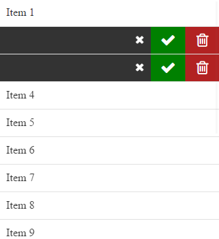

# swipeTo
swipeTo is a jQuery plugin that emulate the native swipe to action feature upon a list on mobile phones
# Usage
### DOM
```HTML
<div class="list">
    <div class="item">
        <a href="#" class="item-swipe">Item</a>
        <div class="item-back">
            ...
        </div>
    </div>
    ...
    <div class="item">
        <a href="#" class="item-swipe">Item</a>
        <div class="item-back">
            ...
        </div>
    </div>
</div>
```
### Javascript
```javascript
$(function() {
    $('.item-swipe').swipeTo({
        minSwipe: 100,
        wrapScroll: 'body',
        binder: true,
        swipeStart: function() {
            console.log('start');
        },
        swipeMove: function() {
            console.log('move');
        },
        swipeEnd: function() {
            console.log('end');
        },
    });
})
```
### Options
#### minSwipe
You can set a minimum swipe size in pixel. If the handler is swiped for less the this option, it will be moved to the origin (to 0px)

#### wrapScroll
This option allows you to set the property "overflow: hidden" on an item during the swipe to prevent vertical scroll

#### binder
You can set this option as true or false to close ad open element swiped with a tap

#### swipeStart, swipeMove, swipeEnd
These are the callbacks that will be initialized, respectively, at the beginning, during ad at the end of the swipe effect

If you want to use default options simply place this code in your javascript file
```javascript
$(function() {
    $('.item-swipe').swipeTo();
})
```
# Demo

# Change Log
该项目clone自[swipeTo](https://github.com/Ipno84/swipeTo)，做了如下改动
* [UPD] 兼容Zepto
* [ADD] 滑动时启用css3硬件加速
* [FIX] 向右滑动随机性无法靠边问题
* [DEL] 废除angle参数